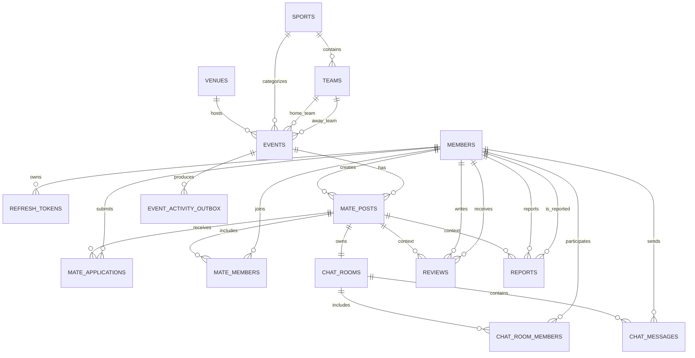

# jikchin-backend
직친(JikChin)- 스포츠 직관 매이트 매칭 서비스

## 로컬 JWT 설정

1. `.env.example`을 프로젝트 루트의 `.env`로 복사합니다.
2. `openssl rand -base64 32`로 키를 생성하고 `.env`의 `JWT_SECRET`에 입력합니다.
3. 프로젝트 루트를 실행 작업 디렉터리로 설정하여 애플리케이션을 실행합니다.

`.env`는 `KEY=value` 형식으로 작성하며 값에 따옴표나 `export`를 붙이지 않습니다.
`application.yaml`이 `.env`를 properties 형식으로 읽어 JWT 설정에 적용합니다.
`.env`는 Git에서 제외되며, 공유용 `.env.example`에는 실제 비밀키를 넣지 않습니다.

- `JWT_SECRET`: Base64로 인코딩한 최소 32바이트 키 (필수, 기본값 없음)
- `JWT_ISSUER`: 발급자 (기본값 `jikchin-backend`)
- `JWT_ACCESS_TOKEN_EXPIRATION`: 액세스 토큰 유효기간 (기본값 `15m`)
- `JWT_REFRESH_TOKEN_EXPIRATION`: 리프레시 토큰 유효기간 (기본값 `14d`)

배포 환경에서는 `.env` 없이 동일한 이름의 환경변수로 설정할 수 있습니다.
테스트는 `src/test/resources/application.yaml`의 별도 테스트 설정을 사용합니다.

## 로컬 MySQL 연결

`.env.example`의 `MYSQL_*` 값을 `.env`에 설정합니다. 예시 비밀번호는 로컬 개발용입니다.
Docker Compose와 Spring이 같은 `.env`의 DB 이름, 사용자, 비밀번호를 사용합니다.

1. 프로젝트 루트에서 `docker compose up -d mysql`을 실행합니다.
2. IntelliJ의 실행 설정에서 Working directory를 프로젝트 루트로 지정합니다.
3. Spring 애플리케이션을 실행합니다.

호스트 접속 포트는 `3306`입니다. 포트를 변경할 때는 Docker Compose의 호스트 포트와 `.env`의 `MYSQL_PORT`를 동일하게 맞춥니다.
컨테이너 내부 MySQL 포트는 `3306`입니다.
기존 MySQL 볼륨이 있으면 사용자와 비밀번호는 최초 초기화 값을 유지하므로 `.env`에도 해당 값을 사용해야 합니다.

로컬 `.env`의 `JPA_DDL_AUTO=update`는 실행 시 엔티티에 맞춰 테이블을 생성·갱신합니다.
이 값을 지정하지 않으면 기본값은 `none`이며, 운영에서는 별도 마이그레이션으로 스키마를 관리합니다.

## 실무 ERD

직친은 경기(`events`)를 중심으로 메이트 모집, 신청·참여, 채팅, 후기, 신고, 인기 경기 랭킹을 연결합니다. 내부 관계는 `BIGINT` 기본 키를 사용하고, 회원의 `member_key` UUID는 JWT 등 외부 노출용 식별자로 유지합니다.

| 테이블 | 책임 | 핵심 제약 |
| --- | --- | --- |
| `members` | 계정, 프로필, 매너 점수 | 이메일·닉네임·`member_key` 유일 |
| `sports`, `teams`, `venues`, `events` | 종목, 팀, 경기장, 실제 경기 일정 | 홈팀과 원정팀은 다르고, 경기는 시작 시각 기준으로 조회 |
| `mate_posts` | 특정 경기의 메이트 모집 | 작성자는 자동 참여자, 최대 인원은 2명 이상 |
| `mate_applications` | 모집글 참여 신청 | 같은 회원은 같은 모집글에 한 번만 신청 |
| `mate_members` | 수락된 실제 참여자 | `(mate_post_id, user_id)` 유일 |
| `chat_rooms`, `chat_room_members`, `chat_messages` | 모집글별 그룹 채팅과 읽음 상태 | 모집글과 채팅방은 1:1, 메시지는 기록 보존 |
| `reviews` | 직관 후 상호 후기 | 한 직관 관계에서 같은 상대에게 한 번만 작성, 별점 1~5 |
| `reports` | 사용자·모집글 신고 | 신고 처리 상태와 사유 보관 |
| `event_activity_outbox` | Redis 인기 경기 랭킹 반영 | 멱등성 키 유일, 처리 시각과 실패 이력 기록 |

### 모집과 참여 처리

신청은 `mate_applications`에 `PENDING`으로 저장하고, 수락된 사용자만 `mate_members`에 넣습니다. 수락은 하나의 트랜잭션에서 처리합니다.

1. 모집글을 잠그고 `OPEN` 상태와 잔여 정원을 확인합니다.
2. 신청을 `ACCEPTED`로 변경하고 참여자를 생성합니다.
3. `current_members`를 증가시키고 정원 도달 시 `CLOSED`로 바꾸니다.
4. 인기 경기 랭킹 반영용 `MEMBER_ACCEPTED` 아웃박스 이벤트를 만듭니다.

`current_members`는 목록의 빠른 표시를 위한 캐시 값이며, 실제 기준은 `mate_members`의 `ACTIVE` 참여자입니다. 모집글 생성 시 작성자도 참여자로 함께 생성해야 두 값이 일치합니다.

### 후기와 채팅

후기는 경기가 끝난 뒤 같은 모집의 활성 참여자끼리만 작성할 수 있습니다. 후기의 원본은 `reviews`이고, `members.manner_score`는 프로필 카드의 빠른 표시용 집계 값입니다.

채팅방은 모집글마다 하나만 생성합니다. 작성자와 수락된 참여자만 입장할 수 있으며, 메시지는 삭제 대신 `deleted_at`을 기록해 신고 조사와 분쟁 대응 기록을 보존합니다.

### Redis 인기 경기 랭킹

인기 순위의 원본은 MySQL이고, Redis는 빠른 정렬 조회용입니다. Redis ZSET에는 `eventId`를 member로 저장합니다.

| 키 | 집계 범위 | 점수 규칙 |
| --- | --- | --- |
| `ranking:events:all` | 전체 | 누적 활동 점수 |
| `ranking:events:weekly:{연도-주차}` | 주간 | 해당 주 활동 점수 |
| `ranking:events:daily:{날짜}` | 일간 | 당일 급상승 경기 |

모집글 생성은 `+5`, 참여 수락은 `+2`, 후기 작성은 `+3` 점입니다. MySQL 저장 후 Redis를 직접 갱신하면 한쪽만 성공할 수 있으므로, 업무 트랜잭션에서 `event_activity_outbox`를 함께 저장하고 워커가 `ZINCRBY`로 반영합니다. `idempotency_key`가 있어 재시도해도 점수가 중복되지 않습니다.

### 현재 백엔드 적용 상태

현재 구현된 도메인은 회원, 모집, 신청, 참여, 후기, 신고, 리프레시 토큰입니다. 경기·팀·경기장·채팅·랭킹 아웃박스는 다음 확장 대상입니다. 또한 현재 일부 회원 참조는 숫자 `user_id` 컬럼이므로, 기존 데이터를 검증한 뒤 `members.id` 외래 키를 추가해야 합니다.

이 ERD는 설계 기준이며, 운영 데이터베이스에는 별도 마이그레이션을 검토한 후 적용합니다.
