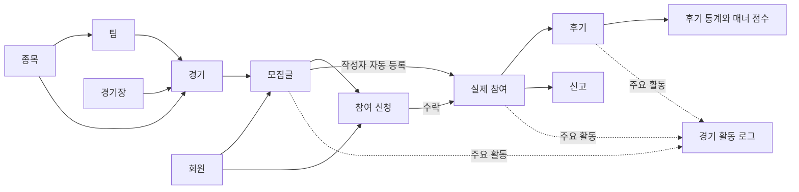

# 직친 도메인 모델

직친은 **같은 스포츠 경기를 보러 갈 사람을 찾고, 함께 참여한 사람에게 후기와 신고를 남기는 서비스**입니다. 이 문서는 서비스에서 다루는 대상을 누구나 이해할 수 있도록 설명합니다.

모델 사이의 관계와 업무 처리 순서는 [도메인 관계와 협력.drawio](<도메인 관계와 협력.drawio>)에서 확인할 수 있습니다. IntelliJ의 Draw.io 플러그인이나 diagrams.net에서 열어 편집할 수 있으며, 서비스 전체 흐름도 1개, 관계도 3개, 협력 흐름도 2개로 총 6개 페이지로 구성되어 있습니다. 첫 페이지에서 가입·경기 조회부터 모집·신청·수락, 후기·신고까지의 전체 흐름을 볼 수 있습니다.

전체 흐름도만 바로 열려면 [서비스 전체 흐름도.drawio](<서비스 전체 흐름도.drawio>)를 사용하세요.

- **속성**: 그 대상이 기억하는 정보입니다. 예를 들어 모집글의 제목과 정원입니다.
- **행위**: 그 대상으로 할 수 있는 일입니다. 예를 들어 신청을 수락하는 일입니다.
- **규칙**: 행위를 할 때 지켜야 하는 조건입니다. 예를 들어 정원을 넘겨 수락할 수 없습니다.

작성 기준은 `feat/domainModelDoc` 분기 시점의 코드(`9b8b91e`)입니다. 규칙은 모델뿐 아니라 요청 검증, 서비스 처리, 데이터베이스 제약을 함께 확인했습니다. **현재 구현된 동작**을 기준으로 하며, 설계만 있거나 아직 연결되지 않은 기능은 별도로 표시합니다.

## 전체 흐름

1. 회원이 가입하고 로그인합니다.
2. 관리자가 종목·팀·경기장을 등록하고 경기 일정을 만듭니다.
3. 회원이 특정 경기의 모집글을 작성합니다. 작성자는 첫 번째 참여자가 됩니다.
4. 다른 회원이 신청하고, 모집자가 수락하면 실제 참여자가 됩니다.
5. 같은 모집의 참여자끼리 후기나 신고를 남길 수 있습니다.
6. 후기 별점은 받은 회원의 통계와 매너 점수에 반영됩니다. 활동 기록 기능이 켜져 있으면 주요 활동도 기록됩니다.

화살표는 업무 흐름과 개념적인 관계입니다. 모두 데이터베이스 외래 키로 연결되어 있다는 뜻은 아닙니다.

### 용어와 모델 구분

| 용어(코드모델) | 쉬운 설명 |
| --- | --- |
| 회원(Member) | 서비스를 이용하는 사람 |
| 리프레시 토큰(RefreshToken) | 로그인 정보를 새로 발급받을 때 쓰는 증표 |
| 종목(Sport) | 야구·축구처럼 스포츠의 종류를 구분하는 기준 |
| 팀(Team) | 경기에서 상대 팀과 겨루는 선수들의 집단 |
| 경기장(Venue) | 경기가 열리고 관객이 직접 관람하는 장소 |
| 경기(Event) | 특정 장소와 시각에 두 팀이 만나는 일정 |
| 모집글(MatePost) | 그 경기를 함께 볼 사람을 구하는 글 |
| 참여 신청(MateApplication) | “함께 가고 싶어요”라는 요청 |
| 참여자(MateMember) | 모집자 또는 수락되어 함께 가기로 한 사람 |
| 후기(Review) | 같은 모집에 참여한 상대방에게 남기는 별점과 글 |
| 후기 통계(ReviewStats) | 회원이 받은 후기의 개수와 평균 별점 등을 모아 보여 주는 요약 정보 |
| 신고(Report) | 같은 모집 참여자의 문제 행동을 운영자에게 알리는 기록 |
| 경기 활동 로그(event_activity_logs) | 경기와 관련된 주요 활동의 이력 |

같은 경기에도 여러 모집글이 있을 수 있습니다. **신청했다고 참여자가 되는 것은 아니며, 같은 경기를 본다는 이유만으로 서로 후기를 쓸 수도 없습니다. 같은 모집의 활성 참여자인지가 기준입니다.**

### 공통 속성 읽는 법

- `id`는 저장된 기록을 구분하는 내부 번호입니다. `userId`, `reviewerId` 등 회원을 가리키는 숫자는 `Member.id`를 의미합니다.
- `memberKey`는 인증 등에 사용하는 별도의 UUID 회원 식별자입니다. 내부 회원 번호와 다릅니다.
- `createdAt`은 생성 시각, `updatedAt`은 최근 수정 시각입니다. 회원·토큰·종목·팀·경기장·경기는 공통 모델 `BaseEntity`를 통해 두 시각을 관리합니다.
- 표의 **선택**은 비워 둘 수 있는 정보입니다. 저장 길이와 API 입력 제한이 다른 경우 규칙에서 구분합니다.

## 1. 회원 — Member

서비스 이용자의 계정과 프로필입니다.

### 속성

| 속성 | 의미 |
| --- | --- |
| `id`, `memberKey` | 내부 회원 번호, 변경되지 않는 UUID 식별자 |
| `email`, `passwordHash` | 로그인 이메일, 원문을 복원할 수 없도록 해시 처리한 비밀번호 |
| `nickname` | 다른 회원에게 보여 주는 이름 |
| `profileImageUrl` | 프로필 이미지 주소 — 선택 |
| `gender`, `birthDate`, `region` | 성별, 생년월일, 지역 — 선택 |
| `mannerTemperature` | 받은 후기의 평균을 반영하는 매너 점수. 가입 시 `36.5` |
| `role` | 일반 회원 `ROLE_USER`, 관리자 `ROLE_ADMIN` |
| `status` | 활동 중 `ACTIVE`, 이용 정지 `SUSPENDED`, 탈퇴 `WITHDRAWN` |
| `createdAt`, `updatedAt` | 가입 및 수정 시각 |

### 행위

- 가입하여 계정과 인증 토큰을 만듭니다.
- 이메일과 비밀번호로 로그인합니다.
- 받은 후기에 따라 매너 점수가 갱신됩니다.

### 규칙

- 이메일·닉네임·UUID는 각각 중복될 수 없습니다. 이메일은 앞뒤 공백을 제거하고 소문자로 저장하며, 닉네임도 앞뒤 공백을 제거합니다.
- 가입 API는 이메일 형식 및 최대 100자, 비밀번호 8~72자, 닉네임 최대 50자를 검사합니다. 세 값 모두 공백만 입력할 수 없습니다.
- 프로필 이미지 주소는 최대 500자, 지역은 최대 50자입니다. 생년월일을 입력하면 과거 날짜여야 합니다. 성별 값은 `MALE`, `FEMALE`입니다.
- 새 회원은 일반 회원이자 활동 중인 회원입니다. 로그인과 토큰 재발급은 활성 회원을 대상으로 합니다.
- 매너 점수는 후기 저장 시 평균 별점을 소수점 둘째 자리까지 반올림하여 반영합니다.
- 회원 정지·탈퇴 상태는 정의되어 있지만 이를 변경하는 업무/API는 아직 없습니다.

## 2. 리프레시 토큰 — RefreshToken

로그인 상태를 이어가기 위해 새 인증 토큰을 발급받는 데 사용하는 기록입니다.

### 속성

| 속성 | 의미 |
| --- | --- |
| `id` | 토큰 기록 번호 |
| `tokenId` | 토큰마다 부여되는 고유 UUID |
| `memberKey` | 토큰을 발급받은 회원의 UUID |
| `expiresAt` | 만료 시각 |
| `createdAt`, `updatedAt` | 기록 생성 및 수정 시각 |

### 행위

- 가입·로그인 시 발급하고 저장합니다.
- 재발급 시 사용한 토큰 기록을 삭제하고 새 토큰을 발급합니다.
- 로그아웃 시 해당 토큰 기록을 삭제합니다.

### 규칙

- `tokenId`는 중복될 수 없습니다. 저장되는 것은 토큰 원문이 아니라 식별자·소유자·만료 시각입니다.
- 재발급하려면 전달한 토큰이 유효하고, 토큰 ID와 회원 UUID에 맞는 저장 기록이 있어야 하며, 회원도 활성 상태여야 합니다.
- 로그아웃은 전달한 리프레시 토큰을 검증한 뒤 해당 저장 기록을 삭제합니다. 이미 기록이 없으면 추가 삭제 없이 종료합니다.
- 회원당 토큰 한 개로 제한하지 않습니다. 로그아웃이 다른 로그인 세션의 토큰이나 이미 발급된 액세스 토큰까지 모두 삭제하는 것은 아닙니다.

## 3. 종목 — Sport

야구나 축구처럼 경기를 분류하는 기준입니다.

### 속성

| 속성 | 의미 |
| --- | --- |
| `id` | 종목 번호 |
| `code` | `BASEBALL` 야구, `FOOTBALL` 축구, `BASKETBALL` 농구, `VOLLEYBALL` 배구 |
| `name` | 화면에 표시할 종목명, 저장 길이 최대 30자 |
| `active` | 사용 여부. 생성 시 `true` |
| `createdAt`, `updatedAt` | 생성 및 수정 시각 |

### 행위

- 관리자가 종목을 등록합니다.
- 팀과 경기에서 종목을 참조합니다.

### 규칙

- 종목 코드는 필수이며 중복될 수 없습니다.
- 이름은 공백만 입력할 수 없고 앞뒤 공백을 제거하여 저장합니다.
- 사용 여부 속성은 있지만 비활성화 API나 비활성 종목의 사용을 막는 검증은 아직 없습니다.

## 4. 팀 — Team

특정 종목에 속하며 경기에서 홈팀 또는 원정팀이 되는 팀입니다.

### 속성

| 속성 | 의미 |
| --- | --- |
| `id`, `sport` | 팀 번호, 소속 종목 |
| `name` | 팀 이름, 저장 길이 최대 100자 |
| `shortName`, `logoUrl` | 줄임 이름 최대 30자, 로고 주소 최대 500자 — 선택, 저장 길이 기준 |
| `active` | 사용 여부. 생성 시 `true` |
| `createdAt`, `updatedAt` | 생성 및 수정 시각 |

### 행위

- 관리자가 기존 종목에 팀을 등록합니다.
- 경기의 홈팀 또는 원정팀으로 지정됩니다.

### 규칙

- 존재하는 종목에 속해야 합니다.
- 같은 종목 안에서는 팀 이름이 중복될 수 없습니다.
- 이름은 공백만 입력할 수 없고 앞뒤 공백을 제거하여 저장합니다.
- 비활성화 API와 비활성 팀의 경기 등록을 막는 검증은 아직 없습니다.

## 5. 경기장 — Venue

경기가 열리는 장소입니다.

### 속성

| 속성 | 의미 |
| --- | --- |
| `id` | 경기장 번호 |
| `name`, `region` | 경기장 이름 최대 150자, 지역 최대 100자 — 저장 길이 기준 |
| `address` | 상세 주소 최대 300자 — 선택, 저장 길이 기준 |
| `createdAt`, `updatedAt` | 생성 및 수정 시각 |

### 행위

- 관리자가 경기장을 등록합니다.
- 경기 일정의 장소로 지정됩니다.

### 규칙

- 이름과 지역은 공백만 입력할 수 없고 앞뒤 공백을 제거하여 저장합니다.
- 이름과 지역의 조합은 중복될 수 없습니다. 지역이 다르면 같은 이름을 사용할 수 있습니다.

## 6. 경기 — Event

두 팀이 특정 시각과 장소에서 만나는 스포츠 경기 일정입니다.

### 속성

| 속성 | 의미 |
| --- | --- |
| `id` | 경기 번호 |
| `sport`, `venue` | 종목, 경기장 |
| `homeTeam`, `awayTeam` | 홈팀, 원정팀 |
| `leagueName` | 리그명, 저장 길이 최대 100자 |
| `startsAt` | 경기 시작 예정 시각 |
| `status` | 예정 `SCHEDULED`, 연기 `POSTPONED`, 취소 `CANCELLED`, 종료 `FINISHED` |
| `createdAt`, `updatedAt` | 생성 및 수정 시각 |

### 행위

- 관리자가 경기를 등록합니다. 최초 상태는 예정입니다.
- 누구나 경기 목록과 상세를 조회할 수 있습니다. 목록은 시작 시각이 빠른 순서입니다.
- 모델에 상태 변경 메서드 `changeStatus`가 있습니다. 이를 호출하는 API는 아직 없습니다.

### 규칙

- 종목·경기장·홈팀·원정팀이 모두 존재해야 합니다.
- 홈팀과 원정팀은 달라야 하며, 두 팀 모두 경기와 같은 종목이어야 합니다.
- 생성 API에서 리그명은 공백일 수 없으며 시작 시각은 미래여야 합니다.
- 종목별 기간 조회는 종목·시작·종료 조건을 모두 전달해야 하고 시작은 종료보다 빨라야 합니다. 요청 크기는 1~100입니다. 조건 없는 전체 조회에는 이 크기 제한이 적용되지 않습니다.
- 현재 상태 변경 메서드에는 상태 전이 순서에 대한 제한이나 자동 종료 처리가 없습니다.
- leagueName의 속성은 선택할 수 있습니다

## 7. 모집글 — MatePost

특정 경기를 함께 보러 갈 모임을 만드는 글입니다. 작성자를 **모집자**라고 부릅니다.

### 속성

| 속성 | 의미 |
| --- | --- |
| `id`, `userId`, `eventId` | 모집글 번호, 모집자 회원 번호, 대상 경기 번호 |
| `title`, `content` | 제목 최대 200자, 본문 |
| `maxMembers`, `currentMembers` | 모집자를 포함한 정원, 현재 참여 인원 |
| `preferredGender` | 선호 성별을 적는 문자열, 최대 20자 — 선택 |
| `minAge`, `maxAge` | 선호 연령의 최솟값과 최댓값 — 선택 |
| `seatInfo` | 좌석 정보, 최대 100자 — 선택 |
| `status` | 모집 중 `OPEN`, 마감 `CLOSED`, 취소 `CANCELLED` |
| `createdAt`, `updatedAt` | 작성 및 수정 시각 |

### 행위

- 회원이 모집글을 만들고 상세를 조회합니다.
- 생성 시 모집자를 활성 참여자로 자동 등록하고 현재 인원을 1명으로 시작합니다.
- 참여자가 추가되면 인원을 1명 늘리고, 정원이 차면 자동 마감합니다.

### 규칙

- 생성 API에서 경기 번호·제목·본문이 필수이며 제목과 본문은 공백만 입력할 수 없습니다. 정원은 최소 2명입니다.
- 연령을 입력하면 각각 0~100세여야 합니다. 둘 다 입력한 경우 최소 나이는 최대 나이보다 클 수 없습니다.
- 모집 중이면서 정원에 여유가 있어야 참여자를 추가할 수 있습니다.
- 동시에 수락해도 정원을 넘지 않도록 같은 모집글의 인원 변경을 순서대로 처리합니다.
- 현재 성별·연령은 안내 정보이며 신청자의 프로필과 대조하여 신청을 차단하지 않습니다.
- 현재 생성 서비스는 경기 번호의 입력 여부만 받고, 해당 경기의 존재나 취소·종료 여부를 확인하지 않습니다.
- 취소 상태는 정의되어 있지만 모집 취소, 인원 감소, 마감 후 재모집 기능은 아직 없습니다.

## 8. 참여 신청 — MateApplication

모집자에게 보내는 참여 요청입니다. 실제 참여 기록과 구별합니다.

### 속성

| 속성 | 의미 |
| --- | --- |
| `id`, `matePost`, `userId` | 신청 번호, 신청한 모집글, 신청자 회원 번호 |
| `message` | 신청 메시지, 최대 500자 — 선택 |
| `status` | 대기 `PENDING`, 수락 `ACCEPTED`, 거절 `REJECTED` |
| `createdAt`, `updatedAt` | 신청 및 처리 시각 |

### 행위

- 회원이 모집글에 신청합니다. 최초 상태는 대기입니다.
- 모집자가 신청 목록을 오래된 순서로 조회하고 신청을 수락하거나 거절합니다.
- 수락하면 신청 상태 변경, 참여자 생성, 모집 인원 증가를 한 번의 작업으로 저장합니다.

### 규칙

- 모집 중인 글에만 신청할 수 있으며 모집자가 자기 글에 신청할 수 없습니다.
- 같은 회원은 같은 모집글에 한 번만 신청할 수 있습니다. 거절되어도 재신청할 수 없습니다.
- 이미 참여 기록이 있으면 탈퇴 상태를 포함하여 신청하거나 다시 수락할 수 없습니다.
- 목록 조회·수락·거절은 해당 모집자만 할 수 있습니다. 처리 대상 신청도 해당 모집글에 속해야 합니다.
- 대기 신청만 수락하거나 거절할 수 있습니다. 수락할 때 모집 상태와 정원도 확인합니다. 거절은 모집 중 상태를 요구하지 않습니다.
- 신청 취소나 처리 결과를 되돌리는 기능은 아직 없습니다.

상태 흐름: `PENDING → ACCEPTED` 또는 `PENDING → REJECTED`.

## 9. 참여자 — MateMember

모집에 실제로 속한 회원의 기록입니다. 같은 사람이 여러 모집에 참여하면 모집마다 별도의 기록을 가집니다.

### 속성

| 속성 | 의미 |
| --- | --- |
| `id`, `matePost`, `userId` | 참여 기록 번호, 모집글, 참여 회원 번호 |
| `joinedAt` | 참여한 시각 |
| `status` | 대기 `PENDING`, 참여 중 `ACTIVE`, 탈퇴 `LEFT` |

### 행위

- 모집글 생성 시 모집자가 참여자가 됩니다.
- 신청 수락 시 신청자가 참여자가 됩니다.
- 내부 서비스의 직접 추가 기능 `addMember`도 있습니다. 외부 참여 추가 API는 없습니다.
- 활성 참여자 목록과 특정 회원의 참여 여부를 조회합니다.
- 모델의 `leave`는 상태를 탈퇴로 바꿉니다. 탈퇴 API와 인원 조정 업무는 아직 연결되어 있지 않습니다.

### 규칙

- 같은 모집글과 회원의 조합으로 참여 기록을 두 개 만들 수 없습니다. 탈퇴해도 기존 기록을 기준으로 중복을 막습니다.
- 일반 참여자 추가는 모집 상태와 정원을 확인합니다. 모집자의 최초 자동 등록은 생성 시점의 별도 처리입니다.
- 참여 여부 판단과 후기·신고 자격 판단에는 `ACTIVE` 상태를 사용합니다.
- 이미 탈퇴한 기록에 다시 `leave`를 호출할 수 없습니다. 재가입 상태 전이는 없습니다.

상태 흐름: `ACTIVE → LEFT`는 모델에만 구현되어 있습니다.

## 10. 후기 — Review

같은 모집에서 함께 참여한 상대방에게 남기는 별점과 글입니다.

### 속성

| 속성 | 의미 |
| --- | --- |
| `id`, `matePost` | 후기 번호, 함께 참여한 모집글 |
| `reviewerId`, `revieweeId` | 작성자 회원 번호, 후기를 받는 회원 번호 |
| `score` | 1~5점의 정수 별점 |
| `content` | 후기 내용, 최대 1,000자 — 선택 |
| `createdAt` | 작성 시각 |

### 행위

- 다른 참여자에게 후기를 작성합니다.
- 특정 회원이 받은 후기를 최신순으로 조회합니다.
- 저장과 함께 받은 회원의 후기 통계·매너 점수를 갱신합니다.

### 규칙

- 자신에게 후기를 남길 수 없습니다.
- 작성자와 상대방 모두 해당 모집글의 활성 참여자 또는 탈퇴 참여자이여 합니다.
- 같은 모집에서 같은 작성자가 같은 상대에게 남기는 후기는 한 번만 허용됩니다. 상대방이 반대로 작성하는 후기는 별개입니다.
- 별점은 1~5점이며, 후기와 통계·매너 점수 갱신은 함께 성공하거나 함께 취소됩니다.
- **경기 종료 후에만 작성하도록 하는 검증은 아직 없습니다.** 현재는 활성 참여 조건을 충족하면 경기 전에도 작성할 수 있습니다.
- 후기 수정·삭제 기능은 아직 없습니다.

## 11. 후기 통계 — ReviewStats

회원이 받은 후기를 매번 모두 읽지 않고 빠르게 요약하기 위한 집계 정보입니다. 원본은 후기입니다.

### 속성

| 속성 | 의미 |
| --- | --- |
| `revieweeId` | 후기를 받은 회원 번호. 통계 기록 자체의 식별자이기도 함 |
| `totalCount`, `scoreSum` | 받은 후기 수, 별점 총합 |
| `count1` ~ `count5` | 1점부터 5점까지 각 점수의 후기 수 |
| 조회 시 계산하는 값 | 평균 별점 `averageScore`, 가장 많이 받은 별점 `mostFrequentScore` |

### 행위

- 새 후기를 저장할 때 해당 회원의 통계를 갱신합니다.
- 평균과 별점별 개수를 조회하고, 평균을 회원의 매너 점수에 반영합니다.
- 통계 기록이 없는 경우 원본 후기에서 조회 결과를 계산합니다. 첫 갱신에서는 기존 후기도 포함하여 통계 기록을 만듭니다.

### 규칙

- 통계는 회원당 하나입니다. 일반 모델 수정이 아니라 전용 집계 처리로 갱신합니다.
- 평균은 별점 합계 ÷ 후기 수이며 소수점 둘째 자리까지 반올림합니다.
- 가장 많이 받은 별점이 동률이면 높은 점수를 선택합니다.
- 후기가 없으면 총수와 점수별 개수는 0이고, 평균과 최빈 별점은 `null`입니다. 가입 시 매너 점수 `5.00`과는 의미가 다릅니다.

예: 5점과 4점을 한 번씩 받았다면 총 2건, 합계 9점, 평균 `4.50`, 최빈 별점은 동률 규칙에 따라 5점입니다.

## 12. 신고 — Report

같은 모집의 참여자에게 문제가 있을 때 운영자의 확인을 요청하는 기록입니다.

### 속성

| 속성 | 의미 |
| --- | --- |
| `id`, `matePost` | 신고 번호, 관련 모집글 |
| `reporterId`, `reportedUserId` | 신고한 회원 번호, 신고 대상 회원 번호 |
| `reason` | 불참 `NO_SHOW`, 욕설·폭언 `ABUSE`, 괴롭힘 `HARASSMENT`, 스팸 `SPAM`, 기타 `ETC` |
| `detail` | 상세 설명, 최대 1,000자 — 선택 |
| `status` | 대기 `PENDING`, 처리 완료 `RESOLVED`, 기각 `REJECTED` |
| `createdAt`, `processedAt` | 접수 시각, 처리 시각. 처리 전에는 처리 시각 없음 |

### 행위

- 회원이 다른 참여자를 신고합니다.
- 관리자가 신고를 오래된 순서로 조회하고 상태별로 걸러 볼 수 있습니다.
- 관리자가 대기 신고를 처리 완료 또는 기각으로 바꾸고 처리 시각을 남깁니다.

### 규칙

- 자신을 신고할 수 없습니다. 신고자와 대상자 모두 해당 모집의 대기 상태가 아니어야 합니다.
- 같은 모집에서 같은 신고자가 같은 대상을 같은 사유로 중복 신고할 수 없습니다. 사유가 다르면 별도 신고가 가능합니다.
- 사유는 필수입니다. 현재 구현은 모집글을 맥락으로 한 회원 신고이며, 대상 회원 없는 모집글 자체 신고는 지원하지 않습니다.
- 대기 상태만 처리할 수 있고 이미 처리된 신고를 다시 처리할 수 없습니다.
- 처리 완료가 자동으로 회원 정지나 점수 차감을 수행하지는 않습니다.

상태 흐름: `PENDING → RESOLVED` 또는 `PENDING → REJECTED`.

## 13. 경기 활동 로그 — EventActivity

어느 경기에서 누가 어떤 활동을 했는지 남기는 이력입니다. 별도의 JPA 모델 클래스 없이 `event_activity_logs` 테이블에 직접 기록합니다.

### 속성

| 속성 | 의미 |
| --- | --- |
| `id`, `occurred_at` | 로그 번호와 활동 발생 시각. 두 값이 함께 기본 키를 구성 |
| `event_id`, `mate_post_id` | 관련 경기와 모집글 번호 |
| `actor_id`, `subject_id` | 행동한 회원, 행동의 대상 회원 — 해당하지 않으면 비움 |
| `activity_type`, `score_delta` | 활동 종류, 활동에 부여한 점수 |
| `source_type`, `source_id` | 원인이 된 기록의 종류와 번호 |
| `idempotency_key` | 활동 종류와 원본 번호를 조합한 중복 식별용 문자열 |
| `payload` | 추가 정보용 JSON — 현재 기록기는 채우지 않음 |
| `created_at` | 저장 시각 |

### 행위

- 기록 기능이 켜져 있을 때 주요 업무와 함께 로그를 저장합니다.
- 관리자가 기간·경기·활동 종류별로 최신 기록을 조회합니다.
- 월별로 경기의 활동 수와 점수 합계를 조회합니다.
- 보관 작업이 활성화되면 월 단위로 저장 공간을 준비하고, 삭제 설정에 따라 오래된 기록을 정리합니다.

| 활동 | 점수 | 행동한 회원 / 대상 회원 | 원본 |
| --- | --- | --- | --- |
| 모집글 생성 `MATE_POST_CREATED` | +5 | 모집자 / 없음 | 모집글 |
| 신청 수락 `MATE_MEMBER_ACCEPTED` | +2 | 수락한 모집자 / 신청자 | 신청 |
| 내부 직접 참여 추가 `MATE_MEMBER_JOINED` | +2 | 없음 / 참여자 | 참여 기록 |
| 후기 작성 `REVIEW_CREATED` | +3 | 작성자 / 받는 회원 | 후기 |

### 규칙

- 로그 저장은 업무 저장과 같은 트랜잭션입니다. 기록 기능이 켜진 상태에서 로그 저장이 실패하면 업무 저장도 취소됩니다.
- 기록은 기본적으로 비활성화되어 있으며 기존 활동을 자동으로 소급 기록하지 않습니다.
- 활동 점수는 발생 이력의 합계입니다. 후기 별점이나 회원 매너 점수와 다르며, 현재 Redis 인기 순위에 반영하는 기능은 없습니다.
- 시각은 UTC 기준입니다. 조회 시작은 포함하고 종료는 제외하며, 조회 크기는 1~100입니다.
- 보관 기준은 지난 12개월 전체와 이번 달입니다. 실제 정리는 관리 작업과 삭제 설정이 켜져 있어야 수행됩니다.
- 중복 제약은 `idempotency_key`와 `occurred_at`의 조합입니다. 같은 키라도 발생 시각이 다르면 저장될 수 있으므로 키 하나만으로 중복 방지가 보장되지는 않습니다.
- 로그에는 외래 키를 두지 않아 원본 기록이 없어져도 관련 번호를 남길 수 있습니다.

설정과 보관 작업의 자세한 내용은 [경기 활동 로그 가이드](../../../docs/event-activity-logs.md)를 참고하세요.

## 예시로 이해하기

민수가 야구 경기의 모집글을 정원 3명으로 만듭니다.

1. 민수가 자동 참여자로 등록됩니다. 현재 인원은 **1/3**, 모집 상태는 **모집 중**입니다.
2. 지수가 신청합니다. 신청은 **대기**이고 아직 참여자가 아니므로 인원은 **1/3**입니다.
3. 민수가 지수를 수락합니다. 신청은 **수락**, 지수는 **활성 참여자**, 인원은 **2/3**이 됩니다.
4. 민수가 다른 신청자까지 수락하면 **3/3**이 되고 자동으로 **마감**됩니다. 남은 대기 신청이 자동 거절되지는 않습니다.
5. 민수와 지수는 같은 모집의 활성 참여자이므로 서로 후기를 남길 수 있습니다. 경기 종료 여부는 현재 검사하지 않습니다.
6. 지수가 민수에게 4점을 남겼고 민수가 받은 다른 후기가 없다면, 민수의 후기 평균과 매너 점수는 **4.00**이 됩니다.
7. 기록 기능이 켜져 있다면 위 모집글 생성·두 번의 수락·한 번의 후기로 경기 활동 점수 **12점(5+2+2+3)**이 기록됩니다. 회원 매너 점수와는 별개입니다.

## 구현 범위와 설계의 차이

기존 README와 ERD에는 향후 설계도 포함되어 있습니다. 현재 동작을 판단할 때는 아래 구분과 실제 코드를 함께 확인합니다.

| 항목 | 현재 구현 |
| --- | --- |
| 종목·팀·경기장·경기 | 등록과 경기 조회 구현됨 |
| 경기 종료 후 후기 제한 | 미구현 |
| 모집 취소·참여 탈퇴·재모집 | 상태 일부는 존재하지만 전체 업무/API 미구현 |
| 성별·연령에 따른 신청 제한 | 선호 조건 저장만 구현 |
| 채팅방·메시지·읽음 상태 | ERD에 설계만 있고 업무 코드 없음 |
| 랭킹 아웃박스·Redis 반영 | 설계만 있음. 현재 활동 로그 및 월별 합계 조회와 구별 |
| 신고 처리에 따른 회원 제재 | 신고 상태 변경만 구현 |

## 코드에서 확인하기

아래 경로의 모델은 속성·상태를, 서비스는 여러 모델이 함께 지키는 규칙을 설명합니다. 각 도메인의 `dto/request`에는 API 입력 제한이 있습니다.

| 범위 | 근거 코드 |
| --- | --- |
| 회원·토큰 | [member](../../main/java/com/jikchin/jikchinbackend/domain/member) |
| 종목·팀·경기장·경기 | [event](../../main/java/com/jikchin/jikchinbackend/domain/event) |
| 모집글 | [matepost](../../main/java/com/jikchin/jikchinbackend/domain/matepost) |
| 신청 | [mateapplication](../../main/java/com/jikchin/jikchinbackend/domain/mateapplication) |
| 참여자 | [matemember](../../main/java/com/jikchin/jikchinbackend/domain/matemember) |
| 후기·통계 | [review](../../main/java/com/jikchin/jikchinbackend/domain/review) |
| 신고 | [report](../../main/java/com/jikchin/jikchinbackend/domain/report) |
| 활동 로그 | [eventactivity](../../main/java/com/jikchin/jikchinbackend/domain/eventactivity), [테이블 정의](../../../docs/sql/event-activity/V001__create_event_activity_logs.sql) |
| API 접근 권한 | [SecurityConfig](../../main/java/com/jikchin/jikchinbackend/global/config/SecurityConfig.java) |
